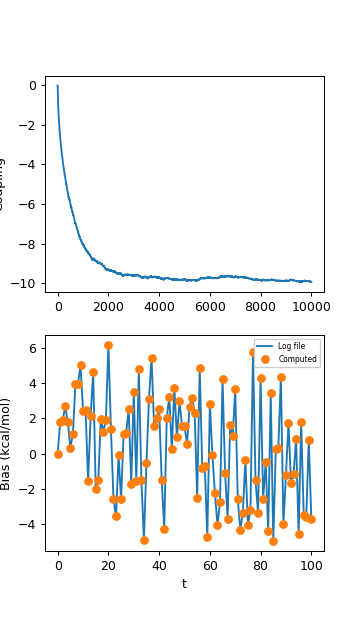
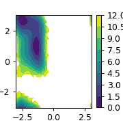

# PLUMED Masterclass 22.6: EDS module + Coarse-Grained directed simulations

## Origin 

This masterclass was authored by Glen Hocky and Andrew White on April 26, 2022

## Aims

This Masterclass describes how to bias simulations to agree with experimental data using experiment directed simulation.

## Objectives

Once this Masterclass is completed, you will know how to:

- How to bias collective variables to agree with set values
- Develop a deeper feeling how parameters in method change learning efficiency

## Prerequisites

We assume that you are familiar with PLUMED and enhanced sampling calculations. If you are not, the 2021 PLUMED Masterclass is a great place to start. In particular, you should be familiar with specifying collective variables.

Furthermore, some Python or other programming knowledge is required for this masterclass to generate plots and perform some analysis calculations.

## Overview

Experiment directed simulation (EDS) is a maximum entropy method for biasing specific collective variables (CVs) to agree with set values. These are typically from experimental data, like a known radius of gyration or NMR chemical shift. Biasing a CV is an under-determined problem because there are many ways to change the systems' potential energy to agree with a set point. If we further maximize ensemble entropy while matching the set point, the problem has a unique solution of

$$
U'(x) = U(x) + \lambda f(x)
$$

where $U(x)$ is the potential energy of the system, $f(x)$ is the CV, and $\lambda$ is a fit parameter. EDS is a time-dependent method that finds $\lambda$ while the simulation is running. It typically converges much faster than free-energy methods, but comes with the same caveats that insufficient sampling or rare events can affect the method. Another important detail is that EDS/maximum entropy biasing is for matching the set point on average (in expectation), rather than at every frame.

## Software and data

The only data needed to complete the exercises of this Masterclass can be found on an the following github page [data](https://github.com/hockyg/plumed-eds-masterclass), with alanine inputs being borrowed from an earlier one [GitHub-22-03](https://github.com/invemichele/masterclass-22-03.git/).
Simulations will be performed using PLUMED's pesmd module, and gromacs.

## Exercises

The exercises are presented below.

### Setup 1-dimensional system.

Set up a plumed file to use with pesmd that has a harmonic potential. Then run using the 1d input provided in the github. For example:

```plumed
d1: DISTANCE ATOMS=1,2 COMPONENTS
ff: MATHEVAL ARG=d1.x PERIODIC=NO FUNC=0.5*10*(x^2)
bb: BIASVALUE ARG=ff

PRINT ARG=d1.x STRIDE=25 FILE=_PREFIX_.colvars.dat
```

````
plumed pesmd < harmonic_1d.in
````

Histogram your data, and see if it fits the ideal Boltzmann distribution for this harmonic oscillator. Make sure to normalize your distribution properly!

Now try adding a harmonic bias using the RESTRAINT function, so that the data becomes centered near $x=1$.

Finally, we will add an EDS bias. Make your EDS bias also be centered at 1.

```plumed
#SOLUTIONFILE=work/plumed_ex1.dat
d1: DISTANCE ATOMS=1,2 COMPONENTS
ff: MATHEVAL ARG=d1.x PERIODIC=NO FUNC=0.5*10*(x^2)
bb: BIASVALUE ARG=ff

eds: EDS ARG=d1.x CENTER=__FILL__ PERIOD=__FILL__ OUT_RESTART=__FILL__ TEMP=1.0 BIAS_SCALE=1
PRINT ARG=* STRIDE=100 FILE=_PREFIX_.colvars.dat
```

Note, we have to add TEMP=1 because pesmd does not provide the temperature to the EDS module.

 
 

Now look at how the bias factor changes with time. Can you also compute the bias from this value, and the value of the position versus time? Look in the colvar file and the restart file to see what values are there.

 

### Setup and bias a 2-dimensional system.

Now we will move on to a 2d harmonic oscillator. This way we can see the effect of biasing x, y, or a combination. Note, there is a different pesmd input file for this.

```plumed
#SOLUTIONFILE=work/plumed_ex2.dat
d1: DISTANCE ATOMS=1,2 COMPONENTS
ff: MATHEVAL ARG=__FILL__ PERIODIC=NO FUNC=__FILL__
bb: BIASVALUE ARG=ff

PRINT ARG=__FILL__ STRIDE=25 FILE=_PREFIX_.colvars.dat
```

Try to bias either the x or y directions separately. Try biasing a combination of them.
We biased the average of x*y to be = 1. Use the CUSTOM command to try that out. What do you think it should look like?
Write a python program to histogram the x and y data and see. It should look like below.


### Alanine dipeptide

Bias alanine dipeptide using gromacs and the input files provided in the github.

```plumed
#SOLUTIONFILE=work/plumed_ex3.dat
MOLINFO STRUCTURE=./input.ala2.pdb
phi: TORSION ATOMS=@phi-2
psi: TORSION ATOMS=@psi-2

eds: EDS ARG=__FILL__ CENTER=__FILL__ PERIOD=__FILL__ OUT_RESTART=_PREFIX_.restart.dat BIAS_SCALE=1

PRINT ARG=* STRIDE=500 FILE=_PREFIX_.colvars.dat
```

Try biasing phi and psi independently. Try biasing them at the same time. What is a good PERIOD to choose?




### Free explore

Take a protein of interest, or alanine 2, and bias more than one variable. To try CGDS, choose the center of mass of some different parts of your protein. Can you bias the distance between these COMs and the angle between them at the same time? Does using COVAR or LM affect the speed of convergence?
